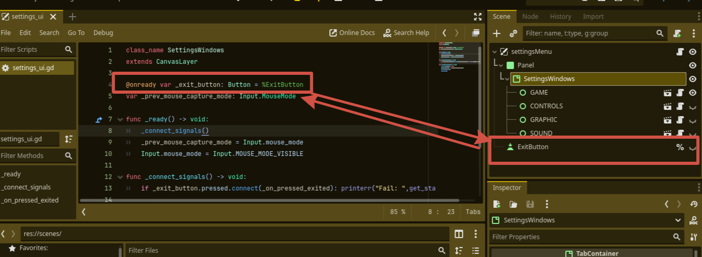
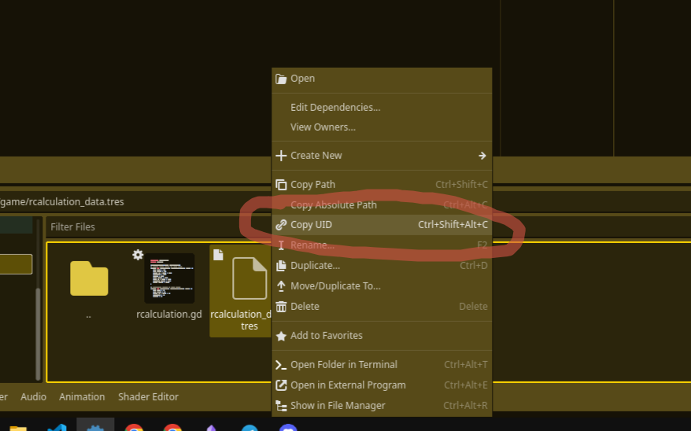
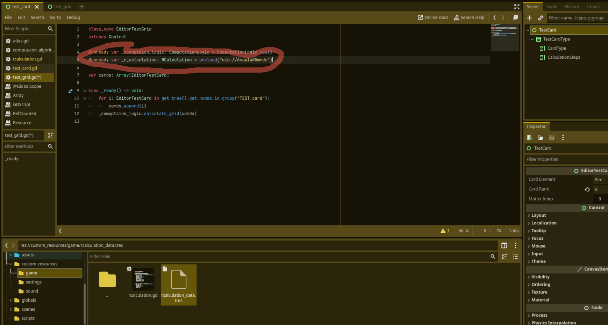

# Technical Design document - (version 0.2.0)
[1. GDScript-Code-Style-Guidelines-(ver-0.0.2)](#gdscript-code-style-guidelines)  
[2. Patterns with working with the Godot editor](#patterns-with-working-with-the-godot-editor) 
## GDScript Code Style Guidelines
### 0. Code Style Guidelines Content
[1. Vocabular](#1-vocabular)  
[2. Code Order](#2-code-order) 
[&nbsp;&nbsp;&nbsp;&nbsp;2.1. Private Order](#21-private-order) 
[3. Formatting](#3-formatting) 
[&nbsp;&nbsp;&nbsp;&nbsp;3.1 Indentation](#31-indentation) 
[&nbsp;&nbsp;&nbsp;&nbsp;3.2 Blank Lines](#32-blank-lines) 
[&nbsp;&nbsp;&nbsp;&nbsp;3.3 Line Length](#33-line-length) 
[&nbsp;&nbsp;&nbsp;&nbsp;3.4 Format multiline statements for readability](#34-format-multiline-statements-for-readability) 
[&nbsp;&nbsp;&nbsp;&nbsp;3.5 Use parentheses for conditional statements ](#35-use-parentheses-for-conditional-statements) 
[&nbsp;&nbsp;&nbsp;&nbsp;3.6 Boolean operators ](#36-boolean-operators) 
[&nbsp;&nbsp;&nbsp;&nbsp;3.7 Whitespace](#37-whitespace) 
[4. Naming conventions](#4-naming-conventions) 
[&nbsp;&nbsp;&nbsp;&nbsp;4.1 Formatting names](#41-formatting-names) 
[&nbsp;&nbsp;&nbsp;&nbsp;4.2 File names and their location](#42-file-names-and-their-location) 
[&nbsp;&nbsp;&nbsp;&nbsp;4.3 Variable names](#43-variable-names) 
[&nbsp;&nbsp;&nbsp;&nbsp;4.4 Class names](#44-class-names) 
[&nbsp;&nbsp;&nbsp;&nbsp;4.5 Function names](#45-function-names) 
[5 Do not!](#5-do-not) 
[&nbsp;&nbsp;&nbsp;&nbsp;5.1 UI Coding](#51-ui-coding) 

### 1. Vocabular

###### Private
Private is conventional modifier for a function, a variable, a signal that says "This data/behavior can be used within ONLY this class". It helps to preserve an invariant of a class and adhere to Encapsulation OOP principle. In order to distinguish between private and public entities, use underscore "_". 

**For example:**

    _speed_state: bool

### 2. Code order
    01. @tool, @icon, @static_unload
    02. class_name
    03. extends
    04. ## doc comment
    
    05 signals
    06. enums
    07. constants
    08. static variables
    09. @export variables
    10. remaining regular variables
    11. @onready variables
    
    12. _static_init()
    13. remaining static methods
    14. overridden built-in virtual methods:
    	1. _init()
    	2. _enter_tree()
    	3. _ready()
    	4. _process()
    	5. _physics_process()
    	6. remaining virtual methods
    15. overridden custom methods
    16. remaining methods
    17. subclasses
##### 2.1 Private Order
You should declare/define private variables first. For example:

    @export exported_variable: int = 2
    signal killed
     signal _self_destroyed

    const _PI = 3.14

    var _some_Private_var: int = 23
    var _another_one: int = 42

    var public_one: int = 49
Same for 15. overridden custom methods and 16. remaining methods.
### 3. Formatting
----
##### 3.1 Indentation
Each indent level should be one greater than the block containing it.

✅

    for i in range(10):
        print("hello")
❌

    for i in range(10):
        print("hello")

    for i in range(10):
            print("hello")
- Use 2 indent levels to distinguish continuation lines from regular code blocks.

✅

    effect.interpolate_property(sprite, "transform/scale",
            sprite.get_scale(), Vector2(2.0, 2.0), 0.3,
            Tween.TRANS_QUAD, Tween.EASE_OUT)
❌

    effect.interpolate_property(sprite, "transform/scale",
        sprite.get_scale(), Vector2(2.0, 2.0), 0.3,
        Tween.TRANS_QUAD, Tween.EASE_OUT)
- Exceptions to this rule are arrays, dictionaries, and enums. Use a single indentation level to distinguish continuation lines:

✅

    var party = [
        "Godot",
        "Godette",
        "Steve",
    ]

    var character_dict = {
        "Name": "Bob",
        "Age": 27,
        "Job": "Mechanic",
    }

    enum Tile {
        BRICK,
        FLOOR,
        SPIKE,
        TELEPORT,
    }
❌

    var party = [
            "Godot",
            "Godette",
            "Steve",
    ]

    var character_dict = {
            "Name": "Bob",
            "Age": 27,
            "Job": "Mechanic",
    }

    enum Tile {
            BRICK,
            FLOOR,
            SPIKE,
            TELEPORT,
    }
----
##### 3.2 Blank Lines
Surround functions and class definitions with ~~two~~ **ONE** blank line~~s~~:

        func heal(amount):
            health += amount
            health = min(health, max_health)
            health_changed.emit(health)

        func take_damage(amount, effect=null):
            health -= amount
            health = max(0, health)
            health_changed.emit(health)
----
##### 3.3 Line Length
Keep individual lines of code under 100 characters. If you can try to keep lines under 80 characters. This helps to read the code on small displays and with two scripts opened side-by-side in an external text editor. For example, when looking at a differential revision.

----
##### 3.4 Format multiline statements for readability
When you have particularly long if statements or nested ternary expressions, wrapping them over multiple lines improves readability. Since continuation lines are still part of the same expression, 2 indent levels should be used instead of one.

✅

    var angle_degrees: float = 135
    var quadrant = (
            "northeast" if (angle_degrees <= 90)
            else "southeast" if (angle_degrees <= 180)
            else "southwest" if (angle_degrees <= 270)
            else "northwest"
    )

    var position: Vector2 = Vector2(250, 350)
    if (
            position.x > 200 and position.x < 400 and
            position.y > 300 and position.y < 400
    ):
        pass
❌

    var angle_degrees = 135
    var quadrant = "northeast" if angle_degrees <= 90 else "southeast" if angle_degrees <= 180 else "southwest" if angle_degrees <= 270 else "northwest"

    var position = Vector2(250, 350)
    if position.x > 200 and position.x < 400 and position.y > 300 and position.y < 400:
        pass
----
##### 3.5 Use parentheses for conditional statements

✅

    if (is_colliding()):
        queue_free()
❌

    if is_colliding():
        queue_free()
---- 
##### 3.6 Boolean operators
Prefer the plain English versions of boolean operators, as they are the most accessible:

    - Use and instead of &&.

    - Use or instead of ||.

You may also use parentheses around boolean operators to clear any ambiguity. This can make long expressions easier to read.
✅

    if ((foo and bar) or !baz):
        print("condition is true")
❌

    if foo && bar || !baz:
        print("condition is true")
---- 
##### 3.7 Whitespace
Always use one space around operators and after commas. Also, avoid extra spaces in dictionary references and function calls. One exception to this is for single-line dictionary declarations, where a space should be added after the opening brace and before the closing brace. This makes the dictionary easier to visually distinguish from an array, as the [] characters look close to {} with most fonts.

✅

    position.x = 5
    position.y = target_position.y + 10
    dict["key"] = 5
    my_array = [4, 5, 6]
    my_dictionary = { key = "value" }
    print("foo")
❌

    position.x=5
    position.y = mpos.y+10
    dict ["key"] = 5
    myarray = [4,5,6]
    my_dictionary = {key = "value"}
    print ("foo")
### 4. Naming conventions
##### 4.1 Formatting names
These naming conventions follow the Godot Engine style. Breaking these will make your code clash with the built-in naming conventions, leading to inconsistent code. As a summary table:
| Type      | Convention |   Example  |
| ----------- | ----------- | -----------|
| File names  | snake_case       |      player_ability.gd      |
| Class names   | PascalCase        |      class_name PlayerStats      |
| Node names   | PascalCase        |    Camera3D, TerrainStatic      |
| Functions   | snake_case        |      func load_level():   |
| Variables   | snake_case        |    var player: Character2D        |
| Signals   | snake_case        |      signal door_opened      |
| Constants   | CONSTANT_CASE        |     const MAX_SPEED: int = 420       |
| Enum names   | PascalCase        |        enum EnemyState    |
| Enum members   | CONSTANT_CASE        |      {HOSTILE, CALM, PATROL}      |
#### 4.2 File names and their location
Use snake_case for file names. For named classes, convert the PascalCase class name to snake_case:

    # This file should be saved as `weapon.gd`.
    class_name Weapon
    extends Node
&nbsp;

    # This file should be saved as `yaml_parser.gd`.
    class_name YAMLParser
    extends Object

Scripts that are statically connected to a scene should be in the same folder as the scene.

#### 4.3 Variable names
- Use **nouns** for variables.
- Use **is_...** template for bollean variables.
- Use unique ID for loading assets like PackedScene, CompressedTexture2D and etc:

        @onready var _action_button_ps: PackedScene = preload("uid://4x5efccvwadl")
- Try to express an intention behind a variable by naming it.
#### 4.4 Class names
- Class names and object must be **nouns**.
#### 4.5 Function names
- Functon names must be **verbs or verb phrases**.
#### 4.6 Signals and signal handles
- Signals should be **verbs in past tense**.
- Signal handles should have this name structure — **_on_signal_name**
- You should connect signals with this method:

if Object.signal.connect(_on_signal_name): printerr("Fail: ",get_stack()) 

    if _options_settings_ui.new_value_selected.connec (_on_language_selected): printerr("Fail: ",get_stack()) 
### 5 Do not!
#### 5.1 UI coding
- Do not connect signals via UI Editor
- Do not assign nodes to groups via UI Editor

## Patterns with working with the Godot editor
1. Use unique names when referencing to scene's nodes in a script.

2. Use UID when referencing to a resource.
